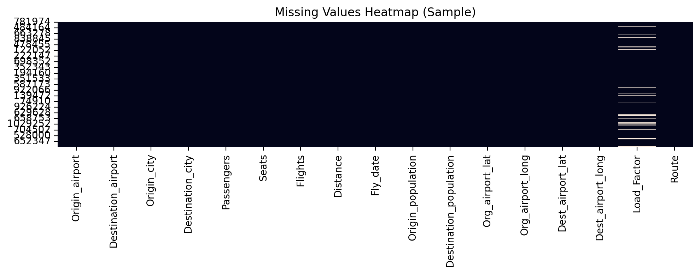
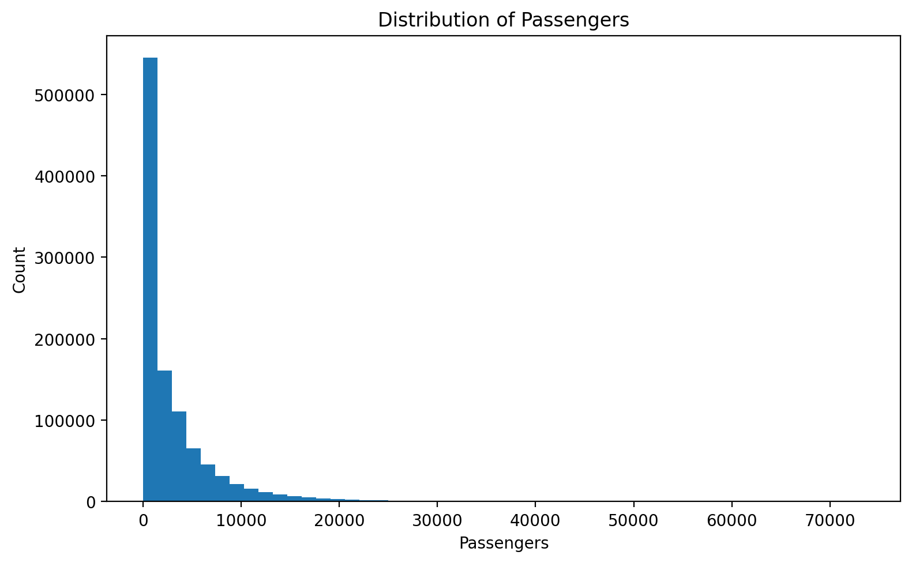
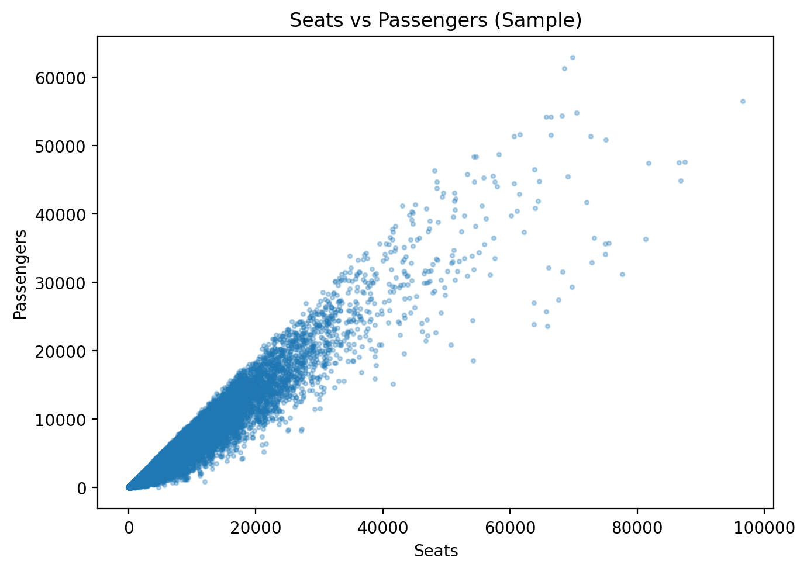
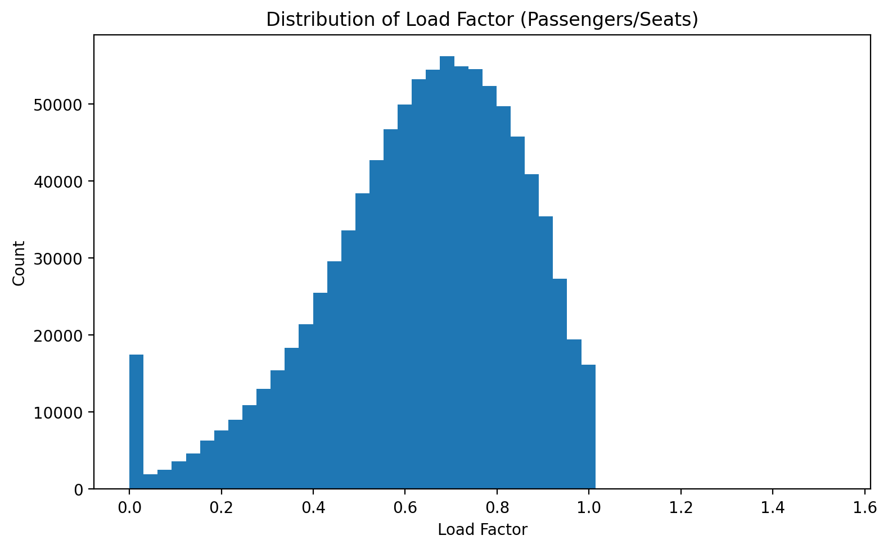
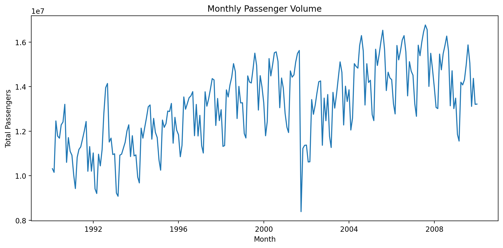
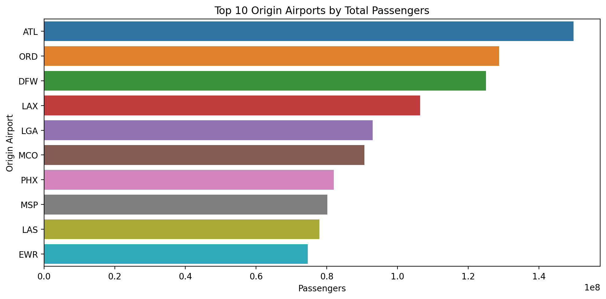
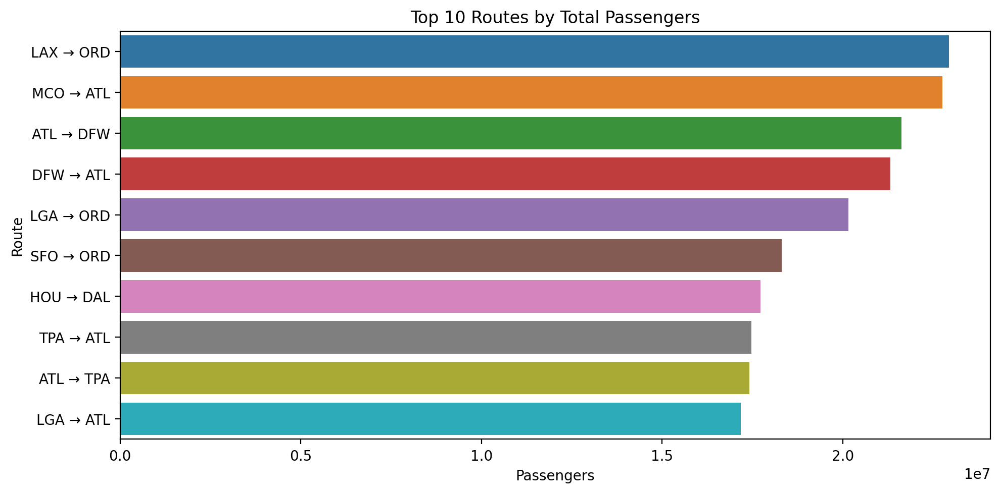
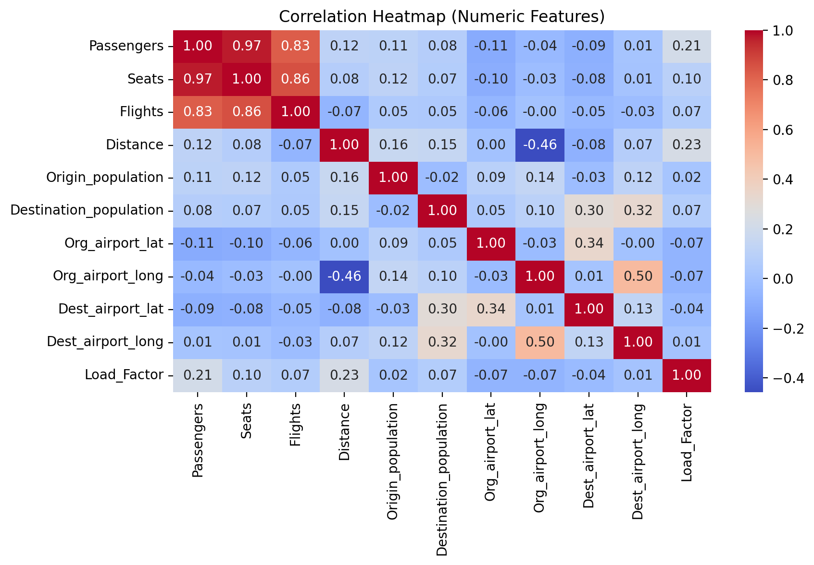

# ✈️ Airport Traffic EDA (Exploratory Data Analysis)

This repository contains an **Exploratory Data Analysis (EDA)** project performed on an airport traffic dataset using **Python** and visualization libraries.

✅ Tools/Libraries used:
- **Pandas**
- **NumPy**
- **Matplotlib**
- **Seaborn**

---

## 📌 Dataset Overview

File used: `airport_data.csv`

The dataset contains flight route and traffic-related features such as:
- Origin & destination airports/cities
- Passengers, seats, flights
- Distance between airports
- Flight date
- Origin/Destination populations
- Airport geo-coordinates (lat/long)

---

## 🎯 Project Objectives

This EDA answers key questions such as:
- What is the distribution of passengers?
- Which airports have the highest passenger traffic?
- Which routes are the busiest?
- What are passenger trends over time?
- How strongly related are numerical features like passengers, flights, seats, and distance?

---

## 🧪 EDA Workflow

The notebook covers:

1. **Importing Libraries**
2. **Loading Dataset**
3. **Data Cleaning**
   - Missing values
   - Data types
   - Date conversion
4. **Feature Engineering**
   - Load Factor = Passengers / Seats
   - Route column (Origin → Destination)
5. **Univariate Analysis**
6. **Bivariate Analysis**
7. **Time-Series Trend Analysis**
8. **Correlation Analysis**

---

## 📊 Charts & Visualizations

All charts below are generated inside the notebook.

### 1) Missing Values Heatmap


### 2) Passenger Distribution


### 3) Seats vs Passengers (Scatter Plot)


### 4) Load Factor Distribution


### 5) Monthly Passenger Trend


### 6) Top 10 Origin Airports by Passengers


### 7) Top 10 Routes by Passengers


### 8) Correlation Heatmap


---

## 📁 Repository Structure

```
├── Airport_Passenger_Analysis.ipynb       # Main Jupyter notebook (EDA)
├── airport_data.csv                       # Dataset
├── README.md                              # Project documentation (this file)
└── github_assets/                         # Exported chart images
    ├── missing_values_heatmap.png
    ├── passengers_distribution.png
    ├── seats_vs_passengers.png
    ├── load_factor_distribution.png
    ├── monthly_passengers_trend.png
    ├── top10_origin_airports.png
    ├── top10_routes.png
    └── correlation_heatmap.png
```


## ✅ Key Insights (Summary)

- Passenger volume shows high variation across routes and airports.
- Certain origin airports dominate overall passenger traffic.
- Load Factor distribution highlights how efficiently seats are utilized.
- Monthly trends show seasonal/temporal changes in passenger flow.
- Strong relationships exist between **Passengers, Seats, and Flights** (confirmed through correlation).

---

## 👤 Author
**Yash Panchal**

GitHub: https://github.com/yashpanchal-dev

---

⭐ If you like this project, feel free to star the repository!
